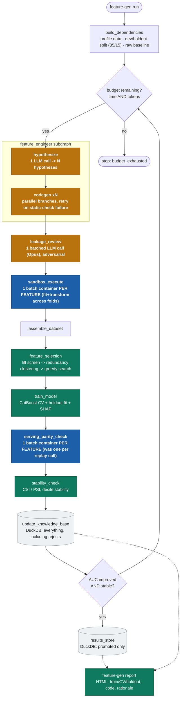

# feature-generator

An autonomous, LLM-driven feature-engineering pipeline for classical binary
classification models. Given a folder of CSV/Parquet tables, it profiles the
data with classical statistics, has an LLM propose and implement candidate
features, validates each one (static safety checks, an adversarial leakage
review, sandboxed execution, a serving-parity replay, and stability metrics),
trains CatBoost on the surviving features, and loops -- reacting to its own
results -- until an operator-set time/token budget runs out. Every feature
tried (including rejects) is recorded in a knowledge base; only validated,
metric-improving features are promoted to a separate results store.

## Architecture

One pipeline run is a Python-level loop (`run_pipeline`) that invokes a LangGraph iteration graph
once per iteration until the configured time/token budget is exhausted. `hypothesize` + `codegen`
form a nested `feature_engineer` subgraph (the "two subagents of one common agent" the design
calls for); the adversarial `leakage_review` gate is deliberately kept outside it. LLM-generated
`fit`/`transform` calls always run inside Docker, batched into one container invocation per
feature (not per fold or per replay-call) for throughput.



Further detail is in each module's docstring under `src/feature_generator/` -- start with
`orchestration/graph.py`, `sandbox/contract.py`, and `dataset/builder.py`.

## Prerequisites

- **Python 3.11+** via [`uv`](https://docs.astral.sh/uv/) (already pinned in `.python-version`)
- **Docker Desktop** running locally -- LLM-generated feature code always
  executes in an isolated container (`sandbox.backend: docker`). Not yet
  installed on a fresh checkout; `feature-gen run` fails fast with a clear
  message if the daemon isn't reachable.
- **`ANTHROPIC_API_KEY`** -- a real pay-per-token API key (subscription OAuth
  tokens are not accepted by the SDK). Put it in a `.env` file at the repo
  root (`ANTHROPIC_API_KEY=sk-ant-...`); `feature-gen` loads it automatically
  via `python-dotenv`. Note this is a metered, billed key -- running the
  pipeline costs real money per API call.
- **Kaggle CLI credentials** (`~/.kaggle/kaggle.json`, see
  https://www.kaggle.com/docs/api) only if you want to pull the example
  competition data via `scripts/download_data.py`. The `kaggle` CLI itself is
  installed as part of the `dev` extra (`uv sync --extra dev`).

## Setup

```sh
uv sync --extra dev          # installs all runtime + test dependencies
docker build -t feature-gen-sandbox:latest src/feature_generator/sandbox/runner_image/
```

## Running the test suite

```sh
uv run pytest tests/unit -q -m "not docker"   # fast, no external dependencies
uv run pytest tests/integration -m docker     # requires Docker Desktop running
```

## Running the pipeline

```sh
uv run python scripts/download_data.py spaceship_titanic
uv run feature-gen run --config configs/spaceship_titanic.yaml
uv run feature-gen inspect --config configs/spaceship_titanic.yaml --run-id <run-id> --show knowledge-base
uv run feature-gen inspect --config configs/spaceship_titanic.yaml --run-id <run-id> --show results
```

Always invoke Python/CLI commands via `uv run ...` (not a bare `python`) --
this repo's dependencies live in a `uv`-managed `.venv` under Python 3.11,
separate from any system Python.

`configs/spaceship_titanic.yaml` targets the simple, single-table, iid
Kaggle ["Spaceship Titanic"](https://www.kaggle.com/competitions/spaceship-titanic)
competition. `configs/ieee_fraud.yaml` targets the harder
["IEEE-CIS Fraud Detection"](https://www.kaggle.com/competitions/ieee-fraud-detection)
competition (two tables joined on `TransactionID`, a genuine relative-time
column `TransactionDT`) to exercise temporal stability and temporal-leakage
detection that the first dataset can't.

## Repository layout

```
src/feature_generator/
  config.py, cli.py            # run configuration, `feature-gen` entrypoint
  orchestration/                # LangGraph wiring (graph.py), budget tracking
  profiling/                     # deterministic (pandas/scipy) data profiling
  agents/                        # Anthropic SDK wrapper + the 3 LLM-driven roles
  sandbox/                       # fit/transform contract, static AST checks, Docker runner
  dataset/                       # fold-wise fit/transform orchestration, feature store
  modeling/                       # CatBoost training, metrics, SHAP, feature selection
  stability/                      # CSI/PSI, decile stability
  serving_parity/                 # online-replay leakage simulator
  knowledge_base/                 # DuckDB knowledge base + results store
tests/
  unit/                          # deterministic, no network/Docker
  integration/                    # Docker-dependent, `pytest -m docker`
  fixtures/                       # compliant + deliberately-leaky feature modules
configs/                          # per-dataset YAML (column roles, budget, model tiers)
scripts/                          # download_data.py, run_spaceship_titanic.py
```
